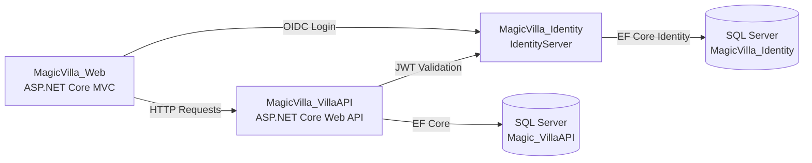

Magic Villa
Magic Villa is an educational ASP.NET Core project that demonstrates a small villa management system using a Web API, an MVC web client, and an IdentityServer-based authentication service.
The solution was built as a learning project for practicing modern .NET backend concepts such as REST APIs, Entity Framework Core, repository pattern, DTO mapping, API versioning, authentication, authorization, and consuming APIs from an ASP.NET Core MVC application.
Project Overview
The application is organized into four projects:
Project	Description
`MagicVilla_VillaAPI`	ASP.NET Core Web API for managing villas, villa numbers, users, JWT authentication, API versioning, Swagger, and EF Core persistence.
`MagicVilla_Web`	ASP.NET Core MVC web application that consumes the Villa API using typed services and displays villa management pages.
`MagicVilla_Identity`	IdentityServer-based authentication service with ASP.NET Core Identity and SQL Server persistence.
`MagicVilla_Utility`	Shared constants and helper definitions used by the web project.
Main Features
Villa CRUD operations
Villa number CRUD operations
ASP.NET Core MVC web interface
RESTful API endpoints
API versioning support
Swagger/OpenAPI documentation
Entity Framework Core with SQL Server
Repository pattern and service layer usage
DTO-based request/response models
AutoMapper object mapping
JWT bearer authentication
Role-based authorization for admin-only actions
IdentityServer integration for authentication flows
Response caching and pagination support in API responses
Architecture

Tech Stack
C#
.NET 7
ASP.NET Core Web API
ASP.NET Core MVC
Entity Framework Core
SQL Server
ASP.NET Core Identity
Duende IdentityServer
JWT Bearer Authentication
OpenID Connect
AutoMapper
Swagger / Swashbuckle
Razor Views
Bootstrap
Solution Structure
```text
MagicVilla.sln
│
├── MagicVilla_VillaAPI
│   ├── Controllers
│   ├── Data
│   ├── Migrations
│   ├── Models
│   ├── Repository
│   └── Program.cs
│
├── MagicVilla_Web
│   ├── Controllers
│   ├── Models
│   ├── Services
│   ├── Views
│   └── Program.cs
│
├── MagicVilla_Identity
│   ├── Data
│   ├── Models
│   ├── Pages
│   ├── Views
│   ├── Migrations
│   └── Program.cs
│
└── MagicVilla_Utility
    └── SD.cs
```
Getting Started
Prerequisites
Install the following tools before running the project:
Visual Studio 2022 or later
.NET 7 SDK
SQL Server or SQL Server Express / LocalDB
SQL Server Management Studio, optional but useful
> Note: This project targets .NET 7. For long-term use, upgrading to a currently supported .NET LTS version is recommended.
1. Clone the Repository
```bash
git clone https://github.com/YOUR_USERNAME/YOUR_REPOSITORY_NAME.git
cd YOUR_REPOSITORY_NAME
```
2. Configure Connection Strings
Update the SQL Server connection strings in these files if needed:
```text
MagicVilla_VillaAPI/appsettings.json
MagicVilla_Identity/appsettings.json
```
Example:
```json
"ConnectionStrings": {
  "DefaultSQLConnection": "Server=.;Database=Magic_VillaAPI;TrustServerCertificate=True;Trusted_Connection=True;MultipleActiveResultSets=true"
}
```
3. Configure Local Service URLs
The MVC project calls the API and Identity projects through the URLs defined in:
```text
MagicVilla_Web/appsettings.json
```
Default configuration:
```json
"ServiceUrls": {
  "VillaAPI": "https://localhost:7001",
  "IdentityAPI": "https://localhost:7003"
}
```
Make sure these ports match the launch profiles of the API and Identity projects.
4. Apply Database Migrations
Run the migrations for both database-backed projects.
For the Villa API database:
```bash
cd MagicVilla_VillaAPI
dotnet ef database update
```
For the Identity database:
```bash
cd ../MagicVilla_Identity
dotnet ef database update
```
5. Run the Solution
Run these projects together:
`MagicVilla_Identity`
`MagicVilla_VillaAPI`
`MagicVilla_Web`
In Visual Studio, you can configure multiple startup projects from the solution properties.
API Documentation
When the API project is running in development mode, Swagger is available at:
```text
https://localhost:7001/swagger
```
The API includes two Swagger versions:
`v1`
`v2`
Main API Areas
The API includes endpoints for:
Villas
Villa numbers
User registration
User login
Versioned API routes
Admin-protected create/update/delete actions
Example route pattern:
```text
/api/v1/VillaAPI
/api/v1/VillaNumberAPI
/api/v1/UsersAuth/login
/api/v1/UsersAuth/register
```
Authentication and Authorization
The project includes two authentication-related approaches:
JWT-based authentication in `MagicVilla_VillaAPI`
OpenID Connect / IdentityServer integration in `MagicVilla_Web` and `MagicVilla_Identity`
Admin-only actions are protected using role-based authorization, for example:
```csharp
[Authorize(Roles = "admin")]
```
Important Security Notes
This repository is intended as a learning project. Before using it in a real environment, review and improve the following areas:
Move JWT secrets and client secrets out of `appsettings.json`.
Do not commit signing keys, temporary keys, or generated IdentityServer key material.
Do not assign every newly registered user to the `admin` role.
Add stronger validation and error handling around login and registration.
Use production-grade secret management such as user secrets, environment variables, or a cloud secret manager.
Upgrade framework and NuGet package versions before any serious deployment.
Known Limitations
No automated tests are included.
Some package versions are preview versions.
The project targets .NET 7.
The project is best treated as a portfolio/learning sample, not as a production-ready booking platform.
Some naming and folder conventions can be improved.
The authentication flow would need additional hardening for production use.
Recommended Improvements
Good next steps for improving this repository:
Upgrade from .NET 7 to a supported LTS version.
Replace preview NuGet packages with stable versions.
Add unit tests and integration tests.
Add a Docker Compose setup for API, MVC, Identity, and SQL Server.
Add seed data documentation.
Add screenshots of the MVC UI and Swagger page.
Improve validation and exception handling.
Separate development and production configuration.
Add CI with GitHub Actions.
Project Status
Educational / portfolio project.
This project is useful for demonstrating ASP.NET Core fundamentals, API development, MVC integration, authentication, authorization, and EF Core database access.
